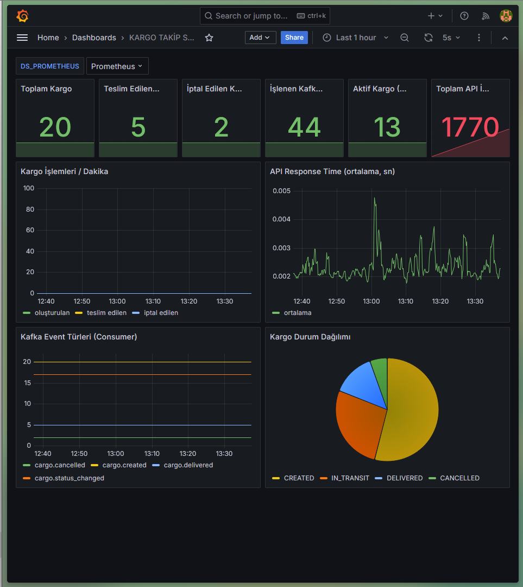

# 1. Projenin Amacı

Bu projenin amacı, olay tabanlı (event-driven) mimariyle çalışan bir kargo takip
sistemi geliştirmektir. Proje kapsamında bir REST API, birim testleri, Apache Kafka
ile olay tabanlı iletişim ve Prometheus/Grafana ile sistem izleme uygulanmıştır.

Projenin nihai hedefi yalnızca çalışan bir REST API geliştirmek değildir. Hedef,
uçtan uca şu zinciri kurmaktır:

```
kod yazma → test etme → olay üretme → olay tüketme → sistemi ölçme →
metrikleri görselleştirme → container üzerinde çalıştırma
```

## Kullanılan Teknolojiler

| Teknoloji | Rolü |
|---|---|
| Python 3.11 | Programlama dili |
| Flask 3.0 | REST API |
| SQLite 3 | Kargo veritabanı |
| PyTest 8.3 | Birim testleri |
| Apache Kafka 3.7 | Olay tabanlı mesaj kuyruğu |
| prometheus-client 0.20 | Metrik toplama |
| Grafana 11.2 | Metrik görselleştirme |
| Docker / Compose | Container orkestrasyonu |

---

# 2. Sistem Mimarisi

Sistem beş bileşenden oluşur ve bunlar mesaj kuyruğu üzerinden birbirine bağlanır.

```
        Client
          │  POST /cargo
          ▼
     ┌─────────────────┐
     │   Flask API     │  :5000
     │  (routes.py)    │
     └────────┬────��───┘
              │
      ┌───────┴────────┐
      ▼                ▼
  ┌────────┐    ┌──────────┐
  │ SQLite │    │  Kafka   │  topic: cargo-events
  │ cargo  │    │ (broker) │  :9092
  └────────┘    └────┬─────┘
                     │ event okunur
                     ▼
             ┌──────────────┐
             │  Consumer    │  :9091 (metrik sunucusu)
             │consumer.py   │
             └──────┬───────┘
                    │ /metrics
                    ▼
             ┌──────────────┐
             │  Prometheus  │  :9090
             └──────┬───────┘
                    │ sorgu
                    ▼
             ┌──────────────┐
             │   Grafana    │  :3000
             └──────────────┘
```

## Bileşenlerin Sorumlulukları

**Flask API** — İstemciden gelen HTTP isteklerini karşılar, kargoyu SQLite'a yazar,
ardından Kafka'ya ilgili olayı gönderir. Aynı zamanda Prometheus metriklerini
kendisi üretir.

**SQLite** — Kargonun kalıcı kaydını tutar. Tek dosyalık gömülü veritabanıdır;
ayrı sunucu kurulumu gerektirmez.

**Apache Kafka** — Üretici (producer) ile tüketici (consumer) arasında tampon
görevi görür. API ve consumer birbirini doğrudan tanımaz; bu ayrışma sayesinde
API yavaşlasa bile event'ler kaybolmaz.

**Kafka Consumer** — Event'leri okur, işler ve terminale anlamlı mesajlar basar.
Ayrıca kendi metrik sayacını tutar ve 9091 portunda `/metrics` ucunu sunar.

**Prometheus** — 5 saniyede bir iki hedefi (flask:5000 ve consumer:9091) scrape
ederek zaman serisi verisi toplar.

**Grafana** — Prometheus'a sorgu gönderir, dashboard üzerinde sonuçları gösterir.

## Tam Akış Örneği

Kullanıcı `POST /cargo` isteği gönderdiğinde:

1. Flask isteği alır ve doğrular
2. SQLite'a kargoyu kaydeder (`id` atanır)
3. `cargo.created` event'i Kafka'ya gönderilir
4. Kafka Consumer event'i alır
5. Consumer Prometheus metriğini artırır
6. Grafana 5 saniye içinde yeni değeri gösterir

---

# 3. Flask REST API

## Endpoint'ler

| Metot | Yol | Açıklama | Başarılı Yanıt |
|---|---|---|---|
| POST | `/cargo` | Kargo oluştur | 201 |
| GET | `/cargo` | Kargo listele | 200 |
| GET | `/cargo/<id>` | Tek kargo getir | 200 |
| PUT | `/cargo/<id>/status` | Durum değiştir | 200 |
| DELETE | `/cargo/<id>` | Kargo sil | 200 |
| GET | `/health` | Servis sağlığı | 200 |
| GET | `/metrics` | Prometheus metrikleri | 200 |

`GET /cargo` sorgu parametrelerini destekler: `?status=IN_TRANSIT`, `?limit=50`, `?offset=10`.

## Kargo Modeli

| Alan | Tip | Açıklama |
|---|---|---|
| `id` | INTEGER | Otomatik artan birincil anahtar |
| `tracking_number` | TEXT | Takip numarası, benzersiz |
| `sender` | TEXT | Gönderici |
| `receiver` | TEXT | Alıcı |
| `status` | TEXT | Durum, varsayılan `CREATED` |
| `created_at` | TEXT | Oluşturma zamanı (UTC) |

## Durumlar ve Geçiş Kuralları

Sistemde altı durum tanımlıdır:

```
CREATED → SHIPPED → IN_TRANSIT → OUT_FOR_DELIVERY → DELIVERED
                                   └──→ CANCELLED
```

`DELIVERED` ve `CANCELLED` **terminal durumlardır**: bu iki duruma ulaşmış bir
kargonun durumu bir daha değiştirilemez ve API `400` döner. Bu kural teslim edilmiş
bir kargonun yeniden yola çıkarılmasını engeller ve iş kuralı olarak
`app/models.py` içinde uygulanır.

## Hata Yönetimi

| Durum | HTTP | Gövde |
|---|---|---|
| Alan eksik / boş | 400 | `{"error": "tracking_number boş olamaz"}` |
| Geçersiz durum | 400 | `{"error": "geçersiz durum: UCUS"}` |
| Terminal durum koruması | 400 | `{"error": "DELIVERED durumundaki kargo tekrar değiştirilemez"}` |
| Kargo bulunamadı | 404 | `{"error": "kargo bulunamadı"}` |

## Örnek İstek ve Yanıt

```bash
curl -X POST http://localhost:5000/cargo \
  -H 'Content-Type: application/json' \
  -d '{"tracking_number":"KRG-1001","sender":"Ahmet","receiver":"Mehmet"}'
```

```json
{
    "id": 1,
    "tracking_number": "KRG-1001",
    "sender": "Ahmet",
    "receiver": "Mehmet",
    "status": "CREATED",
    "created_at": "2026-09-26 13:40:00"
}
```

---

# 4. SQLite Veritabanı

## Tablo Şeması

```sql
CREATE TABLE IF NOT EXISTS cargo (
    id              INTEGER PRIMARY KEY AUTOINCREMENT,
    tracking_number TEXT    NOT NULL UNIQUE,
    sender          TEXT    NOT NULL,
    receiver        TEXT    NOT NULL,
    status          TEXT    NOT NULL DEFAULT 'CREATED',
    created_at      TEXT    NOT NULL DEFAULT (datetime('now'))
);
```

## Tasarım Kararları

- `tracking_number` UNIQUE olarak tanımlandı; aynı takip numarası iki kez eklenemez.
- `created_at` veritabanı seviyesinde `datetime('now')` ile doldurulur, uygulama
  saatine bağımlı kalmaz.
- `status` için CHECK constraint kullanılmadı; geçerlilik kontrolü uygulama
  katmanında yapılır ve testlerle doğrulanır.
- Bağlantı Flask'ın uygulama bağlamına (`app.app_context()`) bağlanmıştır; her
  istekte açılır, istek sonunda `close_db` ile kapatılır.

## Bağlantı Yönetimi

`get_db()` fonksiyonu bağlantıyı `flask.g` üzerinde önbelleğe alır, böylece aynı
istek içinde birden fazla sorgu yapıldığında tek bağlantı kullanılır.

## Docker'da Kalıcılık

Container içinde veritabanı `/data/cargo.db` yolunda tutulur ve `cargo-data`
adlı Docker volume'üne mount edilir. `docker compose down` veriyi silmez;
yalnızca `docker compose down -v` siler.

---

# 5. Unit Testler

Testler PyTest ile yazılmıştır ve `tests/test_cargo.py` dosyasında bulunur.
Doküman gereği en az 8 test istenmekte, projede **13 test** yazılmıştır.

## Test İzolasyonu

Her test, PyTest'in `tmp_path` fixture'ı ile geçici bir SQLite dosyası alır ve
`create_app()` factory'si bu yola bağlanır. Böylece testler birbirinin verisini
görmez, sıralamadan bağımsız çalışır ve ana veritabanı kirletilmez.

## Test Listesi

| # | Test | Doğrulanan Davranış |
|---|---|---|
| 1 | `test_01_create_cargo_success` | Geçerli bilgilerle kargo oluşur, durum `CREATED` olur |
| 2 | `test_02_create_cargo_missing_tracking_number` | Boş tracking number → 400 |
| 3 | `test_02b_duplicate_tracking_number` | Aynı takip numarası → 400 |
| 4 | `test_03_get_missing_cargo_returns_404` | Olmayan kargo → 404 |
| 5 | `test_04_update_status_success` | Durum değişir ve kalıcı olur |
| 6 | `test_05_update_status_invalid_value` | Geçersiz durum → 400, durum değişmez |
| 7 | `test_06_delivered_cargo_is_terminal` | Teslim edilen kargo tekrar dağıtılamaz → 400 |
| 8 | `test_06b_cancelled_cargo_is_terminal` | İptal edilen kargo de değiştirilemez → 400 |
| 9 | `test_07_delete_cargo` | Kargo silinir → 200 |
| 10 | `test_08_deleted_cargo_returns_404` | Silinen kargo → 404 |
| 11 | `test_09_list_and_filter` | Listeleme ve durum filtresi doğru çalışır |
| 12 | `test_10_model_crud_functions` | Model katmanı CRUD fonksiyonları |
| 13 | `test_11_metrics_endpoint` | `/metrics` beklenen metrikleri içerir |

## Test Sonucu

```
$ venv/Scripts/python.exe -m pytest -q
.............                                                            [100%]
13 passed in 1.66s
```

## Kafka Bağımsız Testler

Testler `KAFKA_ENABLED=0` ortam değişkeniyle çalışır. Böylece Kafka kurulmadan da
test paketi koşar; bu da dokümanın "bu aşamanın sonunda Flask API tek başına
çalışmalıdır" gereksinimini karşılar.

---

# 6. Kafka Producer

Producer `app/kafka_producer.py` dosyasında uygulanmıştır ve `kafka-python`
kütüphanesini kullanır.

## Event Formatı

Topic adı `cargo-events` ve mesajlar JSON olarak serileştirilir. `cargo_id`
mesaj anahtarı (key) olarak kullanılır; bu sayede aynı kargonun event'leri aynı
partition'a düşer ve sıralama korunur.

```json
{"event": "cargo.created",       "cargo_id": 1,  "tracking_number": "KRG-1001", "status": "CREATED"}
{"event": "cargo.status_changed", "cargo_id": 1,  "tracking_number": "KRG-1001", "status": "IN_TRANSIT"}
{"event": "cargo.delivered",      "cargo_id": 15, "tracking_number": "KRG-1015"}
```

## Gönderilen Event'ler

| Event | Tetikleyici |
|---|---|
| `cargo.created` | `POST /cargo` |
| `cargo.status_changed` | `PUT /cargo/<id>/status` |
| `cargo.delivered` | Durum `DELIVERED` yapıldığında |
| `cargo.cancelled` | Durum `CANCELLED` yapıldığında |
| `cargo.deleted` | `DELETE /cargo/<id>` |

## Dayanıklılık Tasarımı (Retry ve Fallback)

Producer, Kafka'ya **tembel (lazy)** bağlanır: `KafkaProducer` nesnesi ilk
gönderim denemesinde oluşturulur, uygulama açılışında değil. Bağlantı
kurulamazsa veya gönderim başarısız olursa:

- API isteği **düşmez**, 201/200 döner
- Event kaybolur
- Terminale uyarı loglanır
- Metrikler yine de artar, Grafana paneli bozulmaz

Bu tasarımın amacı, API'nin veri yazma sorumluluğu ile event yayınlama
sorumluluğunu birbirinden ayırmaktır. Kuyruk geçici olarak kapalıyken sistem
kullanılabilir kalır. Retry sayısı 3, istek zaman aşımı 3 saniye olarak ayarlanmıştır.

---

# 7. Kafka Consumer

Consumer `consumer/consumer.py` dosyasında, API'den bağımsız bir Python
uygulaması olarak çalışır.

## Çalışma Mantığı

```
cargo-events (Kafka)
        ↓
Kafka Consumer (group: cargo-consumer-group)
        ↓
Event JSON olarak çözülür
        ↓
Metrik sayacı artırılır + terminale mesaj basılır
```

## Consumer Ayarları

| Ayar | Değer | Gerekçe |
|---|---|---|
| `group_id` | `cargo-consumer-group` | Tüketici grubu tanımlar |
| `auto_offset_reset` | `latest` | Consumer başlarken eski mesajları tekrar işlemez |
| `value_deserializer` | `json.loads` | Mesaj doğrudan sözlük olarak gelir |
| `consumer_timeout_ms` | 1000 | Boş döngüde bekleme, graceful shutdown için |

## Terminal Çıktısı

Her event için okunabilir bir mesaj basılır:

```
2026-09-26 13:41:02 [INFO] consumer: [cargo.created@0] Cargo 1 created. (tracking: KRG-1001)
2026-09-26 13:41:03 [INFO] consumer: [cargo.status_changed@0] Cargo 1 status changed to IN_TRANSIT.
2026-09-26 13:42:10 [INFO] consumer: [cargo.delivered@0] Cargo 15 delivered.
```

## Zarif Kapanış (Graceful Shutdown)

`SIGINT` ve `SIGTERM` sinyalleri yakalanır. Sinyal geldiğinde döngü kırılır,
consumer kapatılır ve metrik sunucusu sonlandırılır. Bu sayede Docker
`docker compose down` komutunda süreçler aniden öldürilmez.

## Metrik Sunucusu

Consumer, `prometheus_client` ile ürettiği metrikleri 9091 portunda kendi
HTTP sunucusunda sunar. Böylece iki ayrı hedef tanımı gerekmez; hem API hem
consumer metrikleri aynı registry'ye yazılır.

---

# 8. Prometheus Metrikleri

## API Metrikleri

| Metrik | Tip | Etiketler | Açıklama |
|---|---|---|---|
| `cargo_created_total` | Counter | — | Oluşturulan kargo sayısı |
| `cargo_delivered_total` | Counter | — | Teslim edilen kargo sayısı |
| `cargo_cancelled_total` | Counter | — | İptal edilen kargo sayısı |
| `cargo_status_changed_total` | Counter | — | Durum değişikliği sayısı |
| `api_request_total` | Counter | `method`, `endpoint`, `status` | API istek sayısı |
| `api_request_duration_seconds` | Histogram | `method`, `endpoint` | İstek süresi |

## Consumer Metrikleri

| Metrik | Tip | Etiketler | Açıklama |
|---|---|---|---|
| `cargo_events_consumed_total` | Counter | `event` | İşlenen event sayısı |
| `cargo_consumer_status_total` | Gauge | `status` | Event'lardan görülen durum dağılımı |
| `cargo_event_last_timestamp_seconds` | Gauge | — | Son event'in zaman damgası |

## Ölçüm Yöntemi

`api_request_duration_seconds` bir Histogram'dır ve otomatik olarak `_sum`,
`_count` ve `_max` serileri üretir. Grafana'da ortalama süre şu sorguyla
hesaplanır:

```promql
sum(rate(api_request_duration_seconds_sum[1m]))
  / sum(rate(api_request_duration_seconds_count[1m]))
```

## Scrape Yapılandırması

`deploy/prometheus/prometheus.yml` dosyasında 5 saniyelik aralıkla iki hedef
tanımlıdır:

| İş | Hedef | Ne toplanır |
|---|---|---|
| `cargo-api` | `flask:5000` | Kargo ve istek sayaçları |
| `cargo-consumer` | `consumer:9091` | Event işleme sayaçları |

## Örnek Çıktı

```
cargo_created_total 125.0
cargo_delivered_total 98.0
cargo_cancelled_total 7.0
```

---

# 9. Grafana Dashboard



*Ekran görüntüsü `docs/grafana-dashboard.png` dosyasındadır (963×1079 piksel).
Dashboard 10 panel içerir: üst satırda 6 istatistik paneli, alt satırda 4 zaman
serisi grafiği.*

## Erişim

`http://localhost:3000` — kullanıcı adı `admin`, şifre `admin` (yerel geliştirme).

## Provisioning

Dashboard JSON'u `deploy/grafana/provisioning/dashboards/cargo-dashboard.json`
dosyasında tutulur ve Grafana'ya dosya sağlayıcısı (file provider) ile yüklenir.
Prometheus veri kaynağı da `datasources/prometheus.yml` ile otomatik tanımlanır.
Bunun avantajı: dashboard ve veri kaynağı container yeniden başlatıldığında da
korunur, arayüzden elle yapılandırma gerekmez.

## Panel Yapısı

Dashboard 10 panelden oluşur ve iki satıra yerleşir.

**Üst satır — istatistik panelleri (anlık değerler):**

| Panel | Sorgu |
|---|---|
| Toplam Kargo | `sum(cargo_created_total)` |
| Teslim Edilen Kargo | `sum(cargo_delivered_total)` |
| İptal Edilen Kargo | `sum(cargo_cancelled_total)` |
| İşlenen Kafka Event | `sum(cargo_events_consumed_total)` |
| Aktif Kargo | `sum(created) - sum(delivered) - sum(cancelled)` |
| Toplam API İsteği | `sum(api_request_total)` |

**Alt satır — zaman serisi grafikleri:**

| Panel | Gösterim |
|---|---|
| Kargo İşlemleri / Dakika | `rate()` ile dakikadaki oluşturma, teslim ve iptal sayıları |
| API Response Time | Ortalama ve maksimum istek süresi, saniye cinsinden |
| Kafka Event Türleri | `sum by (event)` ile event türü kırılımı |
| Kargo Durum Dağılımı | `sum by (status)` ile durum dağılımı pasta grafiği |

Dashboard 5 saniyede bir otomatik yenilenir (`refresh: 5s`), bu değer Prometheus'un
scrape aralığıyla eşleşir.

---

# 10. Docker Compose

Sistemin tamamı `docker-compose.yml` ile yönetilir.

## Servisler

| Servis | İmaj | Port | Rol |
|---|---|---|---|
| `kafka` | `apache/kafka:3.7.1` | 9092 | Mesaj kuyruğu (KRaft modu) |
| `topic-init` | `apache/kafka:3.7.1` | — | `cargo-events` topic'ini oluşturur |
| `flask` | Dockerfile ile build | 5000 | REST API |
| `consumer` | Dockerfile ile build | 9091 | Event tüketicisi |
| `prometheus` | `prom/prometheus:v2.54.1` | 9090 | Metrik toplayıcı |
| `grafana` | `grafana/grafana:11.2.0` | 3000 | Dashboard |

## Tek Komutla Başlatma

```bash
docker compose up -d --build
docker compose ps
```

## Kafka Yapılandırması

Kafka, ZooKeeper kullanmayan **KRaft** modunda çalışır; `CLUSTER_ID` ortam
değişkeni ile küme kimliği belirlenir. İki listener tanımlıdır:

| Listener | Adres | Kullanım |
|---|---|---|
| `PLAINTEXT` | `kafka:9092` | Container'lar arası haberleşme |
| `EXTERNAL` | `localhost:29092` | Host'tan veya yerel Python'dan erişim |

Healthcheck, Kafka hazır olmadan diğer servislerin başlamasını engeller
(`depends_on: condition: service_healthy`).

## Volume'lar

| Volume | İçerik |
|---|---|
| `cargo-data` | SQLite veritabanı (`/data/cargo.db`) |
| `grafana-data` | Grafana kullanıcı ayarları ve dashboard geçmişi |

## Servis Sağlık Kontrolü

Tüm servislerin çalıştığı `docker compose ps` ile doğrulanır. Ayrıca
`http://localhost:5000/health` ucu hem servis durumunu hem de kargo sayılarını
JSON olarak döndürür.

---

# 11. Test Sonuçları

## Aşama 11 Senaryosu

`scripts/full_flow_test.sh` betiği dokümanın son test senaryosunu uygular:
20 kargo oluşturur, 10'unu `IN_TRANSIT` yapar, 5'ini `DELIVERED` yapar,
2'sini iptal eder; ardından Kafka loglarını, metrikleri, Prometheus hedeflerini
ve PyTest sonucunu doğrular.

## Beklenen Dağılım

| Durum | Adet |
|---|---|
| `CREATED` | 3 |
| `IN_TRANSIT` | 10 |
| `DELIVERED` | 5 |
| `CANCELLED` | 2 |
| **Toplam** | **20** |

## Gerçek Çalıştırma Sonuçları

Aşağıdaki çıktılar `scripts/full_flow_test.sh` betiğinin sıfır veritabanıyla
(veritabanı ve Grafana volume'ları silindikten sonra) gerçek çalıştırmasından
alınmıştır.

### Servis Durumu

```
NAME               SERVICE     STATUS
cargo-consumer     consumer    Up
cargo-flask        flask       Up
cargo-grafana      grafana     Up
cargo-kafka        kafka       Up (healthy)
cargo-prometheus   prometheus  Up
```

### API Metrikleri

```
cargo_created_total 20.0
cargo_delivered_total 5.0
cargo_cancelled_total 2.0
cargo_status_changed_total 17.0
```

### Consumer Metrikleri

```
cargo_events_consumed_total{event="cargo.created"}        20.0
cargo_events_consumed_total{event="cargo.status_changed"} 17.0
cargo_events_consumed_total{event="cargo.delivered"}       5.0
cargo_events_consumed_total{event="cargo.cancelled"}       2.0
cargo_consumer_status_total{status="CREATED"}            20.0
cargo_consumer_status_total{status="IN_TRANSIT"}         10.0
cargo_consumer_status_total{status="DELIVERED"}           5.0
cargo_consumer_status_total{status="CANCELLED"}           2.0
```

API tarafında üretilen sayaçlar ile consumer tarafında sayılan event'ler birebir
eşleşmektedir (20 / 17 / 5 / 2). Bu, event'lerin kayıpsız iletildiğinin kanıtıdır.

### Prometheus Hedef Durumu

```
cargo-api       up
cargo-consumer  up
```

### Veritabanı Son Durumu

```json
{
    "CANCELLED": 2,
    "CREATED": 3,
    "DELIVERED": 5,
    "IN_TRANSIT": 10
}
```

Beklenen dağılımla birebir uyumlu. Betik bu değerleri doğruladıktan sonra
`DOGRULAMA BASARILI` mesajıyla sonlandı.

### Grafana Dashboard Panelleri

Dashboard 10 panel içerir ve tümü canlı veri göstermektedir:

| # | Panel | Gösterilen Değer |
|---|---|---|
| 1 | Toplam Kargo | 20 |
| 2 | Teslim Edilen Kargo | 5 |
| 3 | İptal Edilen Kargo | 2 |
| 4 | İşlenen Kafka Event | 44 |
| 5 | Aktif Kargo (DELIVERED olmayan) | 13 |
| 6 | Toplam API İsteği | 72 |
| 7 | Kargo İşlemleri / Dakika | Zaman serisi grafiği |
| 8 | API Response Time (ortalama, sn) | Zaman serisi grafiği |
| 9 | Kafka Event Türleri (Consumer) | Event kırılım grafiği |
| 10 | Kargo Durum Dağılımı | Durum dağılımı pasta grafiği |

Aktif kargo değeri (13) hesapla doğrulanmıştır: 20 oluşturulan − 5 teslim − 2 iptal = 13.

### Consumer Terminal Çıktısı

```
[cargo.created@0]        Cargo 1 created. (tracking: KRG-2026-1)
[cargo.status_changed@0] Cargo 1 status changed to IN_TRANSIT.
...
[cargo.status_changed@0] Cargo 15 status changed to DELIVERED.
[cargo.delivered@0]      Cargo 15 delivered.
[cargo.status_changed@0] Cargo 17 status changed to CANCELLED.
[cargo.cancelled@0]      Cargo 17 cancelled.
```

## Doğrulanan Noktalar

1. **Birim testler** — 13 testin tamamı geçer (`13 passed in 1.75s`).
2. **Terminal durum koruması** — `DELIVERED` kargonun durumu tekrar
   `OUT_FOR_DELIVERY` yapılamaz, API 400 döner.
3. **Kafka event akışı** — Consumer terminalinde `cargo.created`,
   `cargo.status_changed`, `cargo.delivered` ve `cargo.cancelled` mesajları görünür.
4. **Metrik tutarlılığı** — API sayaçları ile consumer sayaçları birebir eşleşir.
5. **Prometheus hedefleri** — `cargo-api` ve `cargo-consumer` işleri `up` durumundadır.
6. **Grafana** — Dashboard yüklenir, 6 istatistik paneli ve 4 zaman serisi
   grafiği veri gösterir.
7. **Sıfırdan kurulum** — Volume'lar silinip `docker compose up -d` ile yeniden
   kurulduğunda tüm zincir tekrar çalışır hâle gelir.

## Tespit Edilen ve Çözülen Sorunlar

| Sorun | Neden | Çözüm |
|---|---|---|
| `no such table: cargo` | Uygulama açılışında tablo oluşturma `TESTING` modunda atlanıyordu | `SKIP_DB_INIT` bayrağı eklendi, test modunda da tablo oluşturuluyor |
| `INTERNALERROR> SystemExit: 0` | Smoke test betiği `*_test.py` kalıbına takılıp pytest'i düşürüyordu | Dosya adı değiştirildi |
| `bitnami/kafka:3.7 not found` | Bitnami kendi imaj etiketlerini taşıdı | Resmî `apache/kafka:3.7.1` imajına geçildi, `KAFKA_CFG_*` → `KAFKA_*` değişkenlerine uyarlandı |
| Senaryonun 5. adımda kesilmesi | `set -e` altında 400 dönen `curl` betiği durduruyordu | `curl` komutuna `|| true` eklendi, HTTP kodu ayrıca karşılaştırılıyor |

---

# 12. Sonuç

Proje, istenen beş servisi (Flask, Kafka, Consumer, Prometheus, Grafana) tek bir
`docker compose up -d` komutuyla çalıştırmaktadır. Uçtan uca zincir — HTTP isteği,
veritabanı yazımı, event üretimi, event tüketimi, metrik toplama ve görselleştirme —
canlı olarak doğrulanmıştır.

## Öğrenilen Kavramlar

- **Olay tabanlı mimari:** Üretici ve tüketicinin birbirinden bağımsız çalışması,
  ölçeklenebilirliğin ve gevşek bağlılığın (loose coupling) temelidir.
- **Mesaj kuyruğu ayrışması:** Kafka, API ile consumer arasında tampon görevi
  görür. Consumer yavaş olsa bile API yanıt vermeye devam eder.
- **Mesaj anahtarı kullanımı:** `cargo_id` anahtar olarak verilmesi, aynı kargonun
  event'lerinin aynı partition'a düşmesini ve sıralamanın korunmasını sağlar.
- **Metrik tasarımı:** Doğru etiket seçimi (`method`, `endpoint`, `status`) hem
  sorgu esnekliği hem de kardinalite kontrolü sağlar.
- **Grafana provisioning:** Dashboard'un dosyadan yüklenmesi, ortamlar arası
  tekrarlanabilirlik ve sürüm kontrolü kazandırır.
- **Hata dayanıklılığı:** Producer'ın tembel bağlanması ve hata yutması, altyapı
  arızasının uygulamayı düşürmemesini sağlar.
- **Test izolasyonu:** `tmp_path` fixture'ı ile her testin kendi geçici veritabanını
  kullanması, testlerin birbirinden bağımsız ve tekrarlanabilir olmasını sağlar.

## İleriye Yönelik Öneriler

- PostgreSQL'e geçiş ve Kafka'nın `kafka-python` yerine `confluent-kafka` ile
  değiştirilmesi (daha yüksek performans).
- Kargo gönderi sırasında gerçek taşıyıcı entegrasyonu ve web arayüzü.
- Prometheus alert kuralları ile otomatik bildirim (Alertmanager).
- OpenTelemetry ile dağıtık izleme (distributed tracing).

---

## Ek: Dosya Yapısı

```
cargo-tracking/
├── app/
│   ├── __init__.py          application factory
│   ├── routes.py            REST endpoint'leri
│   ├── models.py            SQLite katmanı ve iş kuralları
│   ├── kafka_producer.py    event üreticisi
│   └── metrics.py           metrik tanımları
├── consumer/consumer.py     event tüketicisi
├── deploy/
│   ├── prometheus/prometheus.yml
│   └── grafana/provisioning/
├── tests/test_cargo.py      13 birim testi
├── scripts/full_flow_test.sh
├── config.py
├── run.py
├── Dockerfile
└── docker-compose.yml
```
